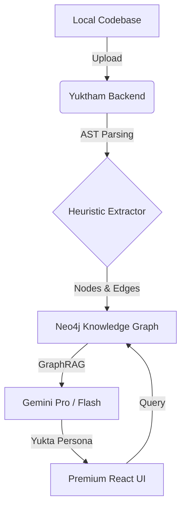

# Yuktham: Architectural Blast-Radius Sentinel 🛡️

Yuktham (Sanskrit for "Logic" or "Reasoning") is a high-fidelity, production-grade AI platform designed to audit codebases for **Architectural Rot**, **AI Slop**, and **Blast-Radius Risks**. 

Unlike generic chatbots, Yuktham uses a **GraphRAG** (Retrieval-Augmented Generation) architecture powered by **Neo4j** and **Google Gemini** to understand the deep structural relationships of your code.


## 🌟 Key Features

### 1. The "Guru Critic" Persona (Yukta)
Meet **Yukta** (युक्ति), your master architect sentinel. Yukta isn't just a bot; it's a "soulful" code critic that:
- **Detects AI Slop**: Identifies low-quality, redundant, or hallucinated code patterns.
- **Exposes Architectural Rot**: Warns you about tight coupling, god-objects, and spaghetti dependencies.
- **Blast-Radius Intuition**: Predicts the ripple effect of any proposed code change.
- **Emotional Intelligence**: Adapts its tone to your emotional state—be it frustration, curiosity, or emergency.

### 2. Live Graph Visualization
- **D3-Powered Canvas**: Explore your codebase as a force-directed graph.
- **Symbiotic Mapping**: Nodes represent Modules, Classes, and Functions; Edges represent Calls, Imports, and Inheritance.
- **Heatmap Overlay**: Visualizes the blast radius of changes in real-time.

### 3. Local-First Architecture
- **Neo4j Community Edition**: All graph data stays on your local instance (via Docker or Desktop).
- **FastAPI Backend**: High-performance Python bridge with tree-sitter-based AST parsing.
- **React + Vite Frontend**: Ultra-fast, responsive UI with premium typography.

---

## 🚀 Quick Start

### 1. Prerequisites
- **Python 3.10+**
- **Node.js 18+**
- **Neo4j Desktop** or Docker (Neo4j instance running at `bolt://localhost:7687`)
- **Google Gemini API Key** (Set as `GEMINI_API_KEY` environment variable)

### 2. Backend Setup
```bash
cd backend
python -m venv venv
source venv/bin/activate
pip install -r requirements.txt
uvicorn server:app --reload
```

### 3. Frontend Setup
```bash
cd frontend
npm install
npm run dev
```

---

## 🏗️ Technical Architecture



### Stack Detail
- **Frontend**: React, D3.js, TailwindCSS (Base), React-Markdown, Remark-GFM.
- **Backend**: FastAPI, Neo4j-Driver, Google-GenAI SDK, Regex-based AST Tokenizers.
- **Graph**: Neo4j (Cypher queries for impact analysis).
- **LLM**: Gemini 2.0/1.5 (Grounding via Subgraph Retrieval).

---

## 🛠️ Usage

1. **Ingest**: Drag and drop your project folder into the sidebar.
2. **Visualize**: Watch the D3 graph materialize your architectural relationships.
3. **Audit**: Use the "Audit" button (coming soon) or simply ask Yukta: *"What happens if I refactor the payment_gateway function?"*
4. **Chat**: Discuss architectural decisions with Yukta. Mention specific symbols to get deep-context insights.

---

## 🛡️ License
Distributed under the MIT License. See `LICENSE` for more information.

---

**Yuktham** – *Don't just write code. Understand its soul.*
